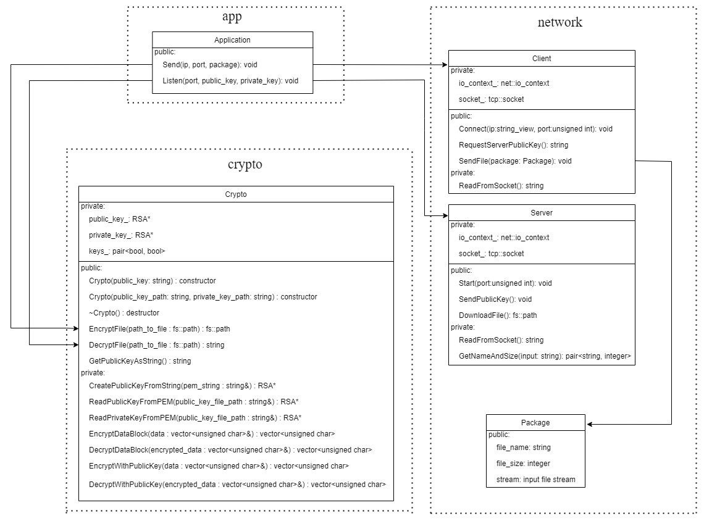
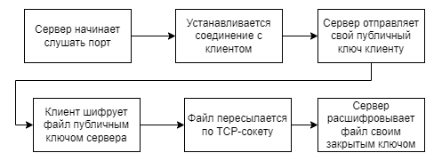

# Secure File Transfer

## Описание
Консольное приложение для защищенного обмена файлами в сети.

В качестве протокола транспортного уровня выбран TCP, так как требуются гарантии доставки и верный порядок
получения пакетов. Для работы через TCP-сокет используется библиотека Boost.Asio.

 Для защиты файлов применяется алгоритм асимметричного шифрования RSA. Криптографические преобразования выполняются посредством библиотеки
OpenSSL. Клиент и сервер обязаны обладать соответствующими сертификатами, с длиной ключа
RSA не менее 1024 бит.


## Запуск через Docker

Для удобства в контейнере уже будут находиться ключи RSA и файл для отправки.

### Подготовка

```shell
sudo docker build -t secure_file_transfer .
sudo docker run --rm -it -p 3333:3333 secure_file_transfer
```

### Smoke-тест

```shell
./smoke_test
```

1) Запускается сервер на порту 3333
2) Создается клиент, отправляется файл package.txt
3) Сравниваются аттрибуты и содержимое изначального файла с полученным

### Запуск сервера. Пример приема файла

```shell
./secure_file_transfer --mode server --port 3333 --public-key ../res/public_key.pem \
                                                 --private-key ../res/private_key.pem
```

### Запуск клиента. Пример отправки файла

```shell
./secure_file_transfer --mode client --address 127.0.0.1/3333 --package ../res/package.txt
```

### Справка

```shell
./secure_file_transfer --help
```

```
General options:
--mode client/server   Set mode: server/client
--help                 produce help message
--config path          Path to config in JSON

Server options:
--port port number     Set listening port: from 1024 до 49151 without root
--public-key path      Path to RSA Public Key (public_key.pem)
--private-key path     Path to RSA Private Key (private_key.pem)

Client options:
--addresses {ip/port}  Receiver's addresses
--packages path        Set path to files
```

## Вручную

### Установка

```shell
mkdir build
cd build
pip3 install conan==1.*
conan install .. --build=missing -s build_type=Release -s compiler.libcxx=libstdc++11
cmake .. -DCMAKE_BUILD_TYPE=Debug
cmake --build . --target all        
```

### Создание ключей (для сервера)

```shell
openssl genrsa -out res/private_key.pem 1024
openssl rsa -in res/private_key.pem -outform PEM -pubout -out res/public_key.pem
```

### Запуск тестов

```shell
ctest --extra-verbose --test-dir build
```

## Архитектура

### UML-диаграмма приложения



### Алгоритм работы


